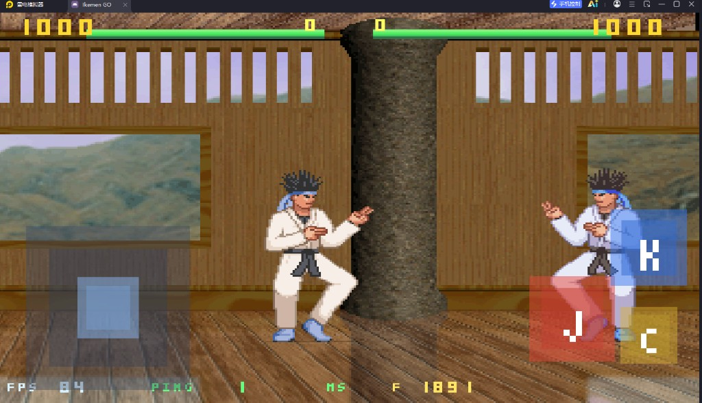

# Ikemen C++ 客户端（大厅 + 对战 + Android）

C++ 运行时对齐 Ikemen GO 的对战循环：角色逻辑用 Lua，引擎用 C++。联网分两段：

- **大厅**：TCP proto3（登录 / 房间，每房最多 2 人）
- **对战**：UDP + KCP 帧同步（`ikemen_relay` 按房间隔离）

默认端口：大厅 **TCP 8080**，对战 **UDP 9000**。

## 对战画面（Android）



上图是手机/模拟器横屏进局后的 HUD：

| 区域 | 含义 |
|------|------|
| 顶栏绿条 + `1000` | 双方生命（满血 1000） |
| 生命条下方橙条 | **怒气**。被打中 1 次 +1，满格（1 点）后右侧 **C** 技能会亮起 |
| 左侧半透明方块 | 虚拟遥感，拖动 = WASD 八向走跳 |
| 右侧 **J / K** | 拳（对应 PC 的 J/K） |
| 右侧 **C** | 满怒气时放 **火炮**：朝对方飞出炮弹，命中扣 **100** 血，并播释放/受击动作 |
| 底栏 `FPS / PING / F` | 帧率、KCP 延迟、当前确认帧 |

PC 无虚拟摇杆：键盘 `WASD` 移动，`J/K` 出拳，`L` 或 `O` 放满怒火炮。窗口必须点一下获得焦点才能动。

## 操作步骤

1. **先起服务**（同一台 PC，本机 IP 例：`192.168.1.107`）  
   仓库根目录：
   ```text
   bin_cpp/ikemen_lobby.exe
   bin_cpp/ikemen_relay.exe
   ```
2. **写 `data/net.ini`**（可从 `data/net.ini.example` 复制），`Lobby` / `Relay` 填这台机器的局域网 IP，不要填手机自己的 IP。
3. **PC 客户端**  
   ```text
   bin_cpp/ikemen_cpp.exe
   ```
   登录页填 USER（密码可空）→ LOGIN 或 REGISTER → 房间列表 **C 创建房间**。用户名不要和手机重复。
4. **手机 APK**  
   安装后在登录页填 **同一套 Lobby/Relay IP**，换一个用户名登录，点进 PC 刚开的 WAIT 房。满 2 人后双方收到 START，自动进 KCP 对战。
5. **对战**  
   遥感走位，J/K 对打；被打一次怒气满，按 C 放火炮。ESC / 返回键离开房间回到列表。

手机和 PC 必须同一 Wi‑Fi。防火墙放行 **TCP 8080** 与 **UDP 9000**。

## 部署

### 本机编译（Windows + MSYS2 MinGW64）

在仓库根目录：

```bash
export PATH=/mingw64/bin:/usr/bin:$PATH
make -C cpp all
```

产物：

| 文件 | 作用 |
|------|------|
| `bin_cpp/ikemen_lobby.exe` | 大厅 |
| `bin_cpp/ikemen_relay.exe` | KCP 对战中继 |
| `bin_cpp/ikemen_cpp.exe` | PC 客户端 |

必须从 **仓库根目录** 启动客户端，才能找到 `chars/kfm` 和 `cpp/lua`。

命令行覆盖 IP：

```text
ikemen_cpp.exe --lobby 192.168.1.107:8080 --relay 192.168.1.107:9000
```

跳过大厅直连房间（调试用）：

```text
ikemen_cpp.exe --host
ikemen_cpp.exe --connect 192.168.1.107
```

### Android APK

用 **Android Studio 打开 `android/` 目录**（不要打开仓库根）。需要 JDK 17、SDK 35、NDK 26.3+、CMake 3.22+。

打 Debug 包（arm64）：

```text
cd android
gradlew.bat assembleDebug
```

APK：`android/app/build/outputs/apk/debug/app-debug.apk`。  
打包前改好仓库里的 `data/net.ini`，Gradle 会把 `chars/kfm`、`cpp/lua`、`data/net.ini` 打进 assets。换资源后客户端内部 `.assets_ver` 会重新解压。

APK **不含** lobby/relay：手机只当客户端。

更细的协议说明见 [docs/TECH.md](docs/TECH.md)。
